# Дипломный проект профессии «1C-программист: с нуля до middle» (Захарова Анастасия)
## Инструкция по начальной настройке
***
### 1. Договоры контрагентов на абонентское обслуживание
***
- Создать новые договоры можно выбрав подсистему "Обслуживание клиентов" - "Обслуживание" - "Договоры контрагентов".
  
- Теперь при создании договоров можно выбрать вид договора "Абонентское обслуживание".

- Заполните период действия договора, сумму ежемесячной абонентской платой и стоимость часа работы специалиста
для дальнейших корректных расчетов.

> 🚩 ___Примечание:__ Если выбрать вид договора "Абонентское обслуживание" и заполнить реквизиты, связанные с этим видом договора,
а затем поменять вид договора на "Поставщик" или "Покупатель" то дополнительные реквизиты, связанные с абонентским обслуживание станут не видны и раннее введенные данные не будут сохранены._

  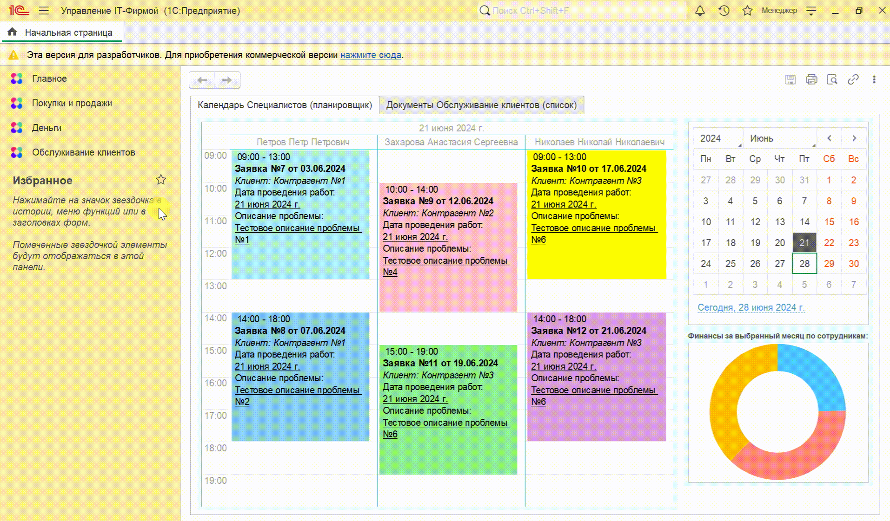 

***
### 2. Обслуживание клиентов
***
#### 📝 Создание документа "Обслуживание клиентов" менеджером компании

- Создать новые документы "Обслуживание клиентов" можно выбрав подсистему "Обслуживание клиентов" - "Обслуживание" - "Обслуживание клиентов".

- В документе выберите клиента, договор (доступны будут только договора соответствующие выбранному клиенту и с видом абонентское обслуживание), специалиста (доступны будут только сотрудники из категории специалисты), дату проведения работ (в дальнейшем по этой дате можно найти данный документ в обработке календарь специалистов), время проведения работ, описание проблемы и комментарий при необходимости.

- Также возможно выбрать цвет документа "Обслуживание клиентов" для отображения в обработке календарь специалистов.

- Если период действия договора не соответствует дате документа, тогда данный документ не будет проведен (для проведения нужен действующий договор).

> 🚩 ___Примечание:__ Перед заполнением документа "Обслуживание клиентов" заполните сотрудников и выберите для них сответствующую категорию._

  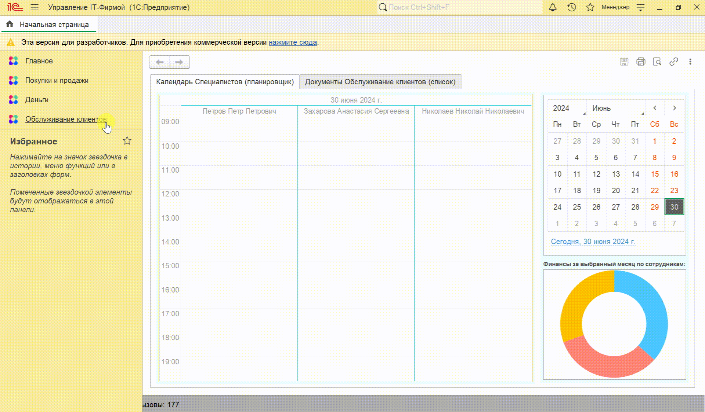 

#### 📝 Возможности обработки "Календарь специалистов"

- После проведения документа "Обслуживание клиентов" он отразиться в обработке "Календаре специалистов", который расположен на начальной странице.

- Обработка "Календарь специалистов" содежит планировщик, в котором отображены специалисты и заявки соответствующие им. А также из обработки, по вкладке можно перейти на список документов "Обслуживание клиентов"

- Обработка "Календарь специалистов" содержит каледарь, где можно выбрать дату (по умолчанию установлена текущая дата) и список заявок специалистов на выбранную дату (дата календаря соответствует дате проведения работ в документе).

- В каждой заявке отображены время проведения работ, номер и дата заявки, клиент, дата проведения работ и описание проблемы. Также цвет заявки соответствует цвету, выбранному в документе "Обслуживание клиентов" (если цвет не установлен, то цвет по умолчанию).

- Обработка "Календарь специалистов" содержит диаграмму "Финансы за выбранный месяц по сотрудникам", которая отражает сумму выплат (процент от работ) по сотрудникам.

- В обработке "Календаре специалистов" можно создавать новые документы "Обслуживание клиентов", а также изменять существующие (например время проведения работ или специалиста) путем растягивания или перетаскивания.

> 🚩 ___Примечание:__ Обработка "Календарь специалистов" содержит только проведенные документы "Обслуживание клиентов", чтобы при изменении сотрудников изменялись и данные в регистрах. А также при изменении в регистре "Условия олаты сотрудников" и изменениях периода действия договора срабатывают стандартные проверки проведения документа "Обслуживание клиентов"_

  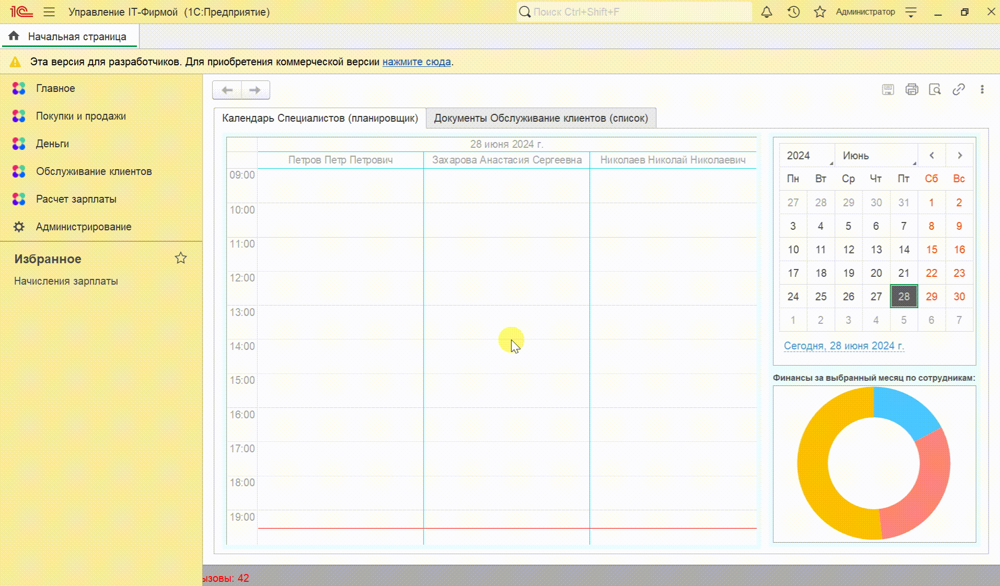 

#### 📝 Возможности Телеграм-бота

- Для оповещения через Телеграм заполните константы: токен управления телеграм-ботом (есть в базе) и идентификатор группы для оповещения (есть в базе).
Местонахождение формы констант телеграм подсистема "Обслуживание клиентов" - "Сервис" - "Константы телеграм".

- Также для более корректной и информативной работы телеграм бота заполните название, контакты, адрес, широту местоположения и долготу местоположения компании.

- Данные телеграм-бота
  - __Name Телеграм-бота__ (1C_Bot)
  - __Username Телеграм-бота__ (Diplom_1C_Bot)
  - __Имя группы телеграм__ (Группа Управление IT-Фирмой)

- Также необходимо для регламентного задания "Отправка сообщений телеграм" задать периодичность повтора.

> 🚩 ___Примечание:__ Токен управления телеграм-ботом и идентификатор группы для оповещения специально отсутствует в видео примере, но есть в базе.
> Для удобства разработчиков создана "Консоль телеграм (для разработчиков)" где можно получить идентификатор группы и отправить сообщение в телеграм без регламентного задания (для ускорения процесса) и также получить необходимую информацию о сообщении.
> Для разработчиков предусмотрен регистр сведений "Логи телеграм (для разработчиков)" где можно найти информацию о Данных и Ошибках HTTP в случае некорректной работы телеграм-бота.
> Также создан справочник "Учетные записи телеграм", где собирается вся информация о пользователях группы телеграм (идентификатор, данные и имя пользователей группой телеграм)._

📌 __Видеоинструкция:__ [__Константы телеграм и Регламентное задание__](https://github.com/Anastasia-Zakharova/Diplom-Zakharova-Anastasia/blob/main/Video-Instructions/04_Телеграм_Константы_РегЗадание.gif)

📌 __Видеоинструкция:__ [__Консоль телеграм (для разработчиков)__](https://github.com/Anastasia-Zakharova/Diplom-Zakharova-Anastasia/blob/main/Video-Instructions/05_Телеграм_КонсольТелеграм.gif)

📌 __Видеоинструкция:__ [__Логи телеграм (для разработчиков)__](https://github.com/Anastasia-Zakharova/Diplom-Zakharova-Anastasia/blob/main/Video-Instructions/07_Телеграм_ЛогиТелеграм.gif)

- Основное назначение телеграм-бота это оповещение о новых заявках клиентов и об изменениях происходящих в них.

>Также данный телеграм-бот обладает рядом другим возможностей:
 >>Отвечает повтором сообщения пользователя и предложением перейти к основной команде /start с возможностями:
 >>>Отправить по запросу фото инструкцию (конфигуратор - общие картинки), аудио инструкцию (конфигуратор - общие макеты) по работе с ним и дополнительную клавиатуру, по которой можно получить контакты (константы телеграм), адрес (константы телеграм), реквизиты компании (конфигуратор - общие макеты) и образец листа учета рабочего времени (конфигуратор - общие макеты).

   

#### 📝 Закрытие документа "Обслуживание клиентов" специалистом компании

- В выполненном специалистом документе "Обслуживание клиентов", необходимо заполнить описание выполненных работ, количество фактически потраченных часов и часов к оплате клиенту (для дальнейшего корректного расчета по клиентам и сотрудникам).

- Также необходимо присоединить к документу заполненный лист учета рабочего времени (для подтверждения выполненных работ).

  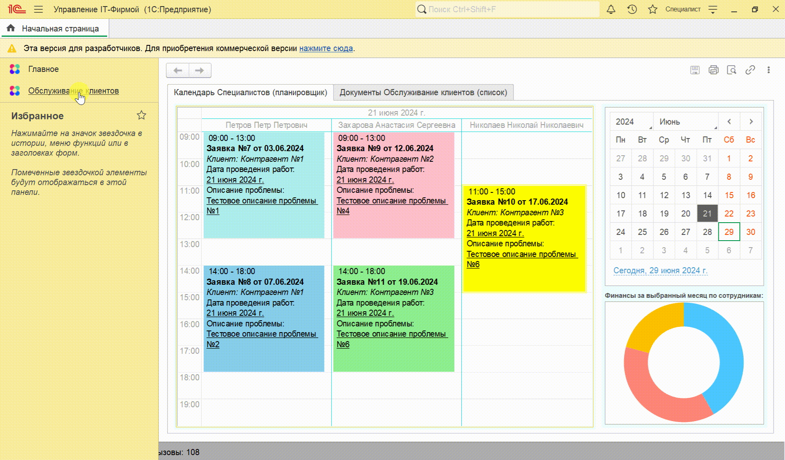 

📌 __Видеоинструкция:__ [__Демонстрация регистров документа "Обслуживание клиентов"__](https://github.com/Anastasia-Zakharova/Diplom-Zakharova-Anastasia/blob/main/Video-Instructions/09_Обслуживание_ДемонстрацияРегистров.gif)

***
### 3. Реализации товаров и услуг
***
#### 📝 Автоматическое заполнение документа "Реализации товаров и услуг"

- Заполните константы номенклатура абонентская плата и номенклатура работы специалиста.
  Местонахождение формы констант номенклатуры подсистема "Обслуживание клиентов" - "Сервис" - "Константы номенклатура".

 

 - Создать новые документы "Реализация товаров и услуг" можно выбрав подсистему "Обслуживание клиентов" - "Реализация" - "Реализация товаров и услуг".

 - Необходимо заполнить организацию, контрагента и договор. Затем если в документе "Реализация товаров и услуг" выбран договор с видом абонентская плата, то возможно выполнить автозаполнения такого документа суммой ежемесячной абонентской платы и суммой за выполненные в течения месяца работ по данным документов "Обслуживание клиентов".

 - Возможности Команды "Заполнить"
   - Система предупредит, что данные таблицы "Товары" и таблицы "Услуги" будут очищены и таблица "Услуги" будет заполненна данными по обслуживанию клиентов. Только в случае положительного ответа система продолжит автоматическое заполнение.
   -  Система выполнит проверку на вид договора, период действия договора, заполнение констант номенклатуры и на дублирование актов реализации.
   -  Система сообщит за какой месяц создан акт реализации в виде декорации.
   -  Система в реквизите комментарии запишет за какой месяц создан акт и об отсутствии работ специалистов (если не было выполненных работ за месяц документа).
   -  Система в реквизите основание запишет первый документ "Обслуживание клиентов" за месяц документа, если выполненных работ в течении месяца документа не было, выберите любой подходящий документ "Обслуживание клиентов" для проведения документа.
  
> 🚩 ___Примечание:__ Также можно автоматически заполнить документ "Реализация товаров и услуг" данными по обслуживанию клиентов из документа "Обслуживание клиентов" по команде "Создать на основании"._
> > 📌 ___Видеоинструкция:__ [__Демонстрация заполнения документа "Реализация товаров и услуг" из документа "Обслуживание клиентов"__](https://github.com/Anastasia-Zakharova/Diplom-Zakharova-Anastasia/blob/main/Video-Instructions/12_ДокументРеализация_Обслуживание.gif)_

 

  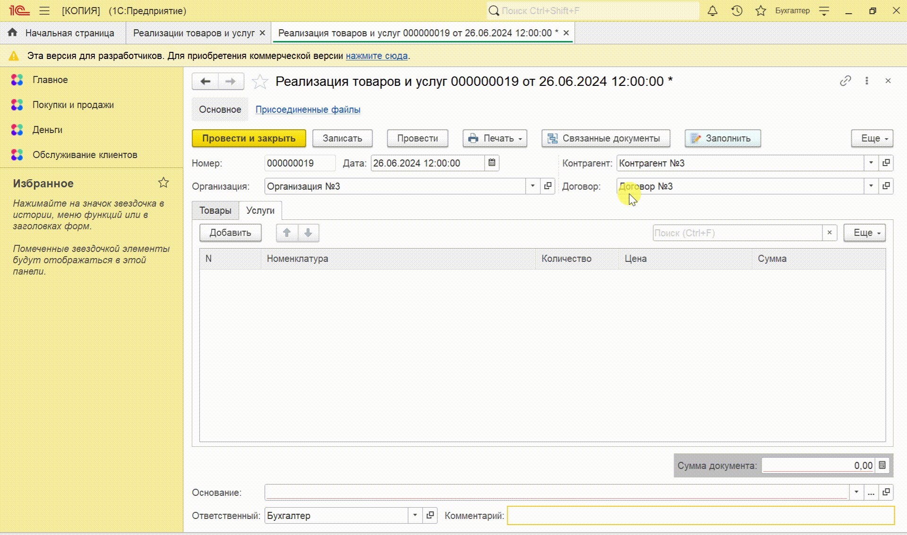 

 

📌 __Видеоинструкция:__ [__Демонстрация проверок команды "Заполнить"__](https://github.com/Anastasia-Zakharova/Diplom-Zakharova-Anastasia/blob/main/Video-Instructions/10_ДокументРеализации_Проверки.gif)

📌 __Видеоинструкция:__ [__Демонстрация проверок при проведении документа "Реализация товаров и услуг"__](https://github.com/Anastasia-Zakharova/Diplom-Zakharova-Anastasia/blob/main/Video-Instructions/13_ДокументРеализация_ПроверкаПроведения.gif)

#### 📝 Печатная форма акта об оказанных услугах

- Перед использованием команды "Печать" лучше дозаполнить справочник "Организации" (для вывода в печатную форму логотипа, подписи и печати).

📌 __Видеоинструкция:__ [__Демонстрация заполнения справочника "Организации" для вывода подписи и печати__](https://github.com/Anastasia-Zakharova/Diplom-Zakharova-Anastasia/blob/main/Video-Instructions/14_ЗаполнениеСправочникаОрганизации.gif)

- По команде печать можно вывести документ "Реализация товаров и услуг" с данными по таблице "Услуги" и по таблице "Товары", с QR-кодом и логотипом организации. Также отметив галочку "Подписи и печати" в печатной форме отобразиться подпись и печать. 
 
- По команде печать можно вывести "Акт об оказанных услугах (word)" с данными по таблице "Услуги" и данными исполнителя и заказчика.

  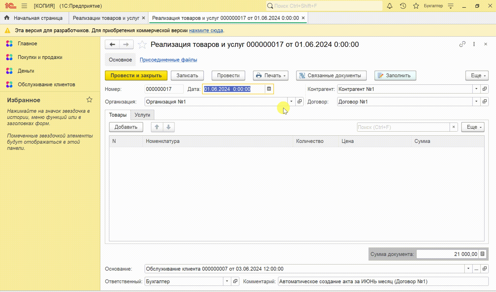 

 

#### 📝 Массовое создание документов "Реализация товаров и услуг"

-  Местонахождение обработки "Массовое создание актов" подсистема "Обслуживание клиентов" - "Сервис" - "Массовое создание актов".
  
-  В данной обработке возможно сформировать акты по всем действующим абонентским договорам за выбранный месяц (без дублирования актов).

-  По умолчанию в обработке установлен текущий год и месяц. возможно выбрать необходимый год и месяц.

-  После выполнения команды "Заполнить" таблица заполниться списком договоров и ссылками на созданные реализации по этим договорам за выбранный месяц (система сообщит если нет действующих договоров по которым не созданы акты за выбранный месяц).

  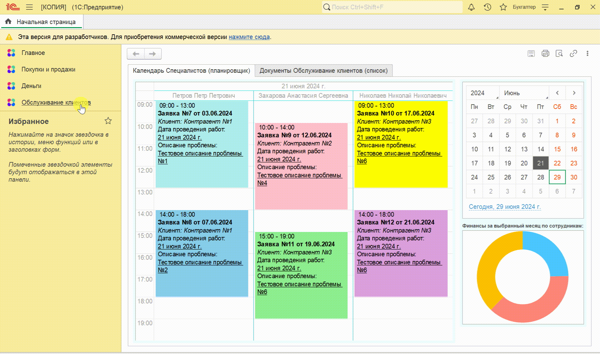 

 

***
### 4. Расчёт зарплаты
***

#### 📝 Начисление зарплаты

- Перед тем как переходить к начислению зарплаты, необходимо выполнить ряд действий.
  - Заполнить регистр "Графики работы" по выбранному графику работы из спавочника "Графики работы" (пятидневка, шестидневка). Заполнение регистра "Графики работы" происходит автоматически с помощью обработки "Заполнение графика" (Расчет зарплаты - Сервис - Заполнение графика)
  - Убедиться, что все работающие сотрудники занесены в бызу и для всех заполнены категории и условия оплаты.
  - 📌 __Видеоинструкция:__ [__Демонстрация заполнения регистра "Графики работы" и регистра "Условия оплаты сотрудников"__](https://github.com/Anastasia-Zakharova/Diplom-Zakharova-Anastasia/blob/main/Video-Instructions/18_Демо_График_УсловияОплаты.gif)
 
- Создать новые документы "Начисление заработной платы" можно выбрав подсистему "Расчет зарплаты" - "Начисления" - "Начисления зарплаты".
 
- В документе "Начисления зарплаты" выбираем сотрудника, вид расчета (оклад или отпуск), дату начала и окончания (по умолчанию начало и конец месяца документа), и график работ (по умолчанию пятидневка).
 
- Оклад рассчитывается исходя из фактически отработанных дней (если хотим начислить оклад полностью просто указываем начало и конец месяца документа) (основные начисления).
 
- Если оклад рассчитывается для сотрудника, который входит в категорию специалистов, то процент за выполненные работы будет начислен ему автоматически за месяц документа (дополнительные начисления).
 
- Отпускные расчитываются как (Начисленная сумма за 12 предыдущих месяца / Количество рабочих дней за 12 предыдущих месяца) х Количество дней отпуска. В период отпуска оклад не начисляется (основные начисления). 
 
- Удержания в виде НДФЛ (13%) также рассчитываютя автоматически от суммы основных и дополнительных начислений (удержания).
 
- Итоговые начисления сотрудникам за месяц рассчитываются как ОсновныеНачисления + ДополнительныеНачисления - Удержания (взаиморасчеты с сотрудниками).
 
- Фактическое количество дней отпуска это количество дней без учета графика работы (отпуска сотрудников).

> 🚩 ___Примечание:__ Виды расчетов в планах видов расчета являются предопределенными и не подлежат изменению._
> > 📌 ___Видеоинструкция:__ [__Демонстрация Планов видов расчета__](https://github.com/Anastasia-Zakharova/Diplom-Zakharova-Anastasia/blob/main/Video-Instructions/17_ПланыВидовРасчета.gif)_
 

  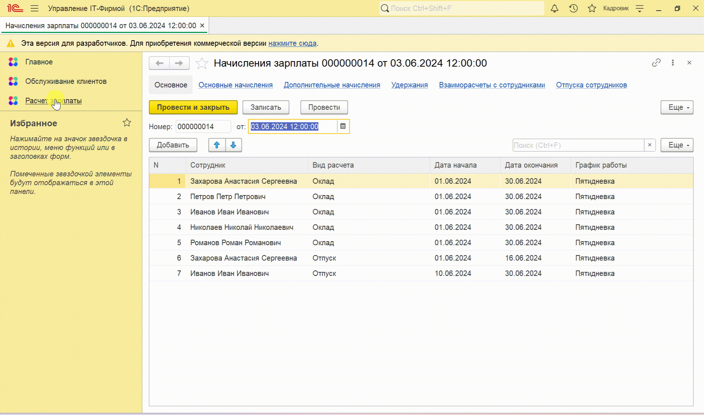 

 

> 🚩 ___Примечание:__ Так как дополнительные начисления процент от выполненных работ зависит от документов "Обслуживание клиентов", а в них возможны изменения. Поэтому организован механизм перерасчета и соответственно отчет по перерасчетам._
> > 📌 ___Видеоинструкция:__ [__Демонстрация Отчета "Перерасчеты (процент от работ)"__](https://github.com/Anastasia-Zakharova/Diplom-Zakharova-Anastasia/blob/main/Video-Instructions/20_Отчет_ПерерасчетЗарплаты.gif)_

 
#### 📝 Начисление фиксированной премии

- Создать новые документы "Начисление  фиксированной премии" можно выбрав подсистему "Расчет зарплаты" - "Начисления" - "Начисление фиксированной премии".
 
- В документе "Начисление фиксированной премии" выбираем сотрудника и устанавливаем сумму премии.

- Вся сумма премии по сотруднику относится к виду расчетов фиксированная премия (дополнительные начисления).

- Удержания в виде НДФЛ (13%) также рассчитываютя автоматически от суммы премии (удержания).

- Итоговые начисления премии рассчитываются как ДополнительныеНачисления - Удержания (взаиморасчеты с сотрудниками).

  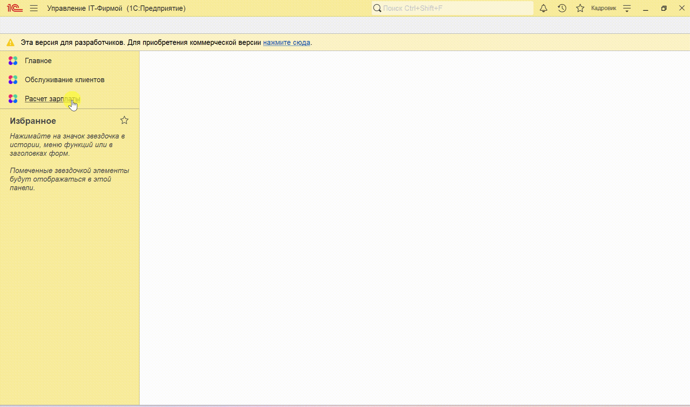 

 

***
### 5. Выплата зарплаты
***
- Создать новые документы "Выплата зарплаты" можно выбрав подсистему "Расчет зарплаты" - "Выплаты" - "Выплата зарплаты".

- В документе есть команда "Заполнить" которая автоматически заполнит таблицу сотрудниками и необходимыми суммами выплат на дату документа.

- Далее возможно изминить суммы выплат исходя из необходимости.

- Выплаченные по документу суммы попадут в регистр "Взаиморасчеты с сотрудниками".

 

   

 

***
### 6. Планирование отпусков
***
- Создать новые документы "График отпусков" можно выбрав подсистему "Расчет зарплаты" - "Отпуска" - "График отпусков".

- В документе необходимо выбрать год, за который будет создан график отпусков (по умолчанию текущий год).

- Далее необходимо заполнить сотрудников и дату начала и окончания отпуска. Если год даты начала или окончания не будет соответствовать выбранному году, то система сообщит об этом. Также если период отпуска будет задан не верно система также об этом сообщит.

> 🚩 ___Примечание:__ Сотрудники у которых общая длительность отпуска более 28 календарных дней подсвечиваются красным в документе._

   

 

- Также в документе "График отпусков" есть команда "Вывести график отпусков", которая построит диаграмму ганта по отпускам сотрудников за год (по месяцам).

 > 🚩 ___Примечание:__ Сотрудники у которых общая длительность отпуска более 28 календарных дней имеют значок отпуска и выделенны красным в диаграмме._

   

 

***
### 7. Отчеты по обслуживанию клиентов
***
#### 📝 Отчет "Выработка специалистов"

- Сформировать отчет "Выработка специалистов" можно выбрав подсистему "Обслуживание клиентов" - "Отчеты" - "Выработка специалистов".

- Выбираем период и сотрудника по которому хотим получить данные.

- Отчёт "Выработка специалистов" показывает, сколько часов за выбранный период отработал выбранный специалист и какая сумма ему за этот период начислена в виде процента от выплат клиента.

#### 📝 Отчет "Анализ выставленных актов"

- Сформировать отчет "Анализ выставленных актов" можно выбрав подсистему "Обслуживание клиентов" - "Отчеты" - "Анализ выставленных актов".

- Выбираем период за который хотим получить данные.

- Отчёт "Анализ выставленных актов" показывает информацию о клиентах, договорах и суммах, которые должны быть выставлены клиентам на основе данных из документов Обслуживание (то есть показывает фактическую сумму по номенклатуре из константы "Номенклатура работы специалиста" за выбранный период).

- Также Отчёт "Анализ выставленных актов" показывает фактическую сумму по номенклатуре из константы "Номенклатура работы специалиста", которая выставлена в текущем месяце.

- Также Отчёт "Анализ выставленных актов" показывает фактическую сумму по номенклатуре из константы "Номенклатура абонентская плата", которая выставлена в текущем месяце.

#### 📝 Отчет "Обслуживание клиентов (дашборд)"

- Сформировать отчет "Обслуживание клиентов (дашборд)" можно выбрав подсистему "Обслуживание клиентов" - "Отчеты" - "Обслуживание клиентов (дашборд)".

- Отчёт "Обслуживание клиентов (дашборд)" отражает данные за текущий месяц (есть возможность обновления).

- Отчёт "Обслуживание клиентов (дашборд)" показывает две диаграммы:
  - Первая диаграмма показывает данные по клиентам (суммы выполненных работ по данным документов "Обслуживание клиентов").
  - Вторая диаграмма показывает данные по дням (суммы выполненных работ по данным документов "Обслуживание клиентов").
 

  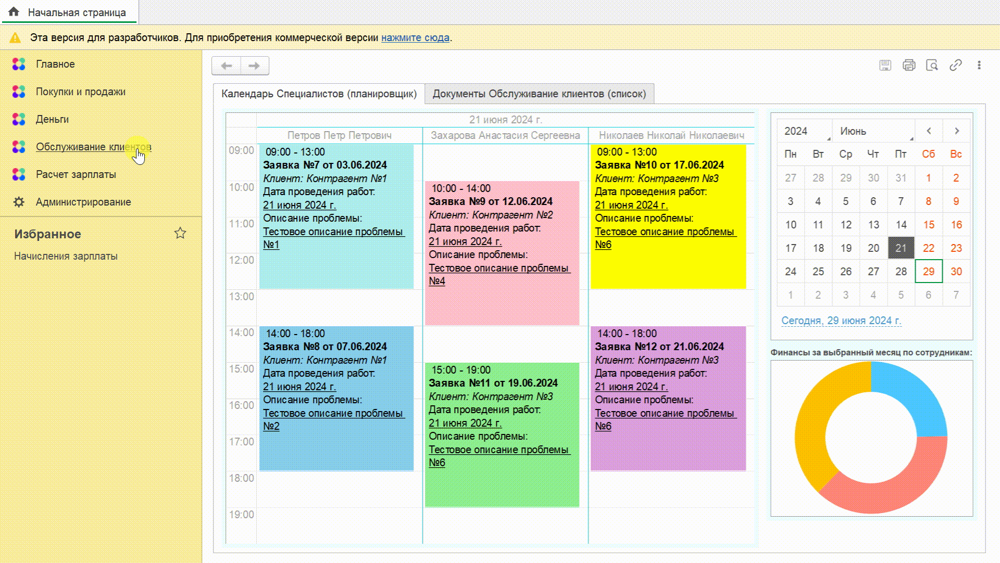 

 

***
### 8. Отчеты по расчетам с сотрудниками и отпускам
***
#### 📝 Отчет "Расчёты с сотрудниками"

- Сформировать отчет "Расчёты с сотрудниками" можно выбрав подсистему "Расчет зарплаты" - "Отчеты" - "Расчёты с сотрудниками".

- Выбираем период за который хотим получить данные.

- Отчёт "Расчёты с сотрудниками" показывает информацию о том, какие суммы начислены и выплачены каждому сотруднику за выбранный период. И задолженности на начало и на конец выбранного периода.

#### 📝 Отчет "Расход запланированных отпусков"

- Сформировать отчет "Расход запланированных отпусков" можно выбрав подсистему "Расчет зарплаты" - "Отчеты" - "Расход запланированных отпусков".

- Выбираем год за который хотим получить данные (можно выбрать на каледаре любую дату с нужным годом, по умолчанию установлен текущий год).

- Отчёт "Расход запланированных отпусков" показывает сколько дней отпуска у сотрудника в выбранный период по плану и сколько дней он фактически был в отпуске.

  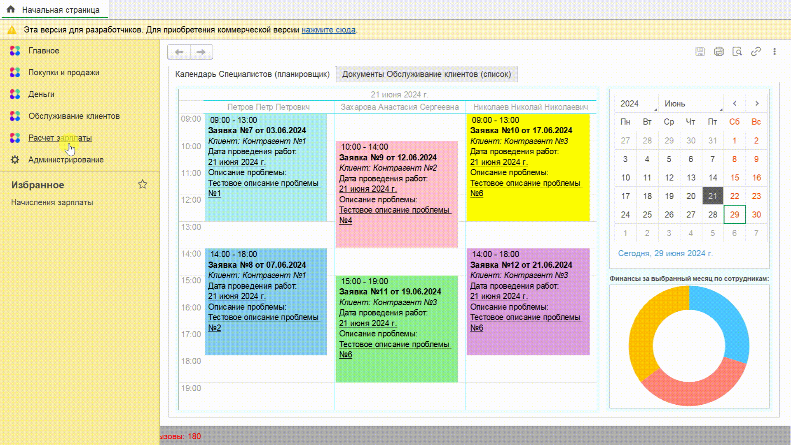 

 

***
### 9. Права доступа
***
- Создать пользователей и установить им права можно выбрав подсистему "Администрирование" - "Настройки пользователей и прав" - "Пользователи".

- Созданы новые поставляемые профили, которые можно назначить соответствующим пользователям (Менеджер, Специалист, Бухгалтер ИТ-Фирмы, Кадровик расчетчик).

 📌 __Видеоинструкция:__ [__Демонстрация создания новых пользователей и назначение им соответствующего профиля__](https://github.com/Anastasia-Zakharova/Diplom-Zakharova-Anastasia/blob/main/Video-Instructions/27_УстановкаПравДоступа.gif)

# 🥳 Спасибо за внимание!
